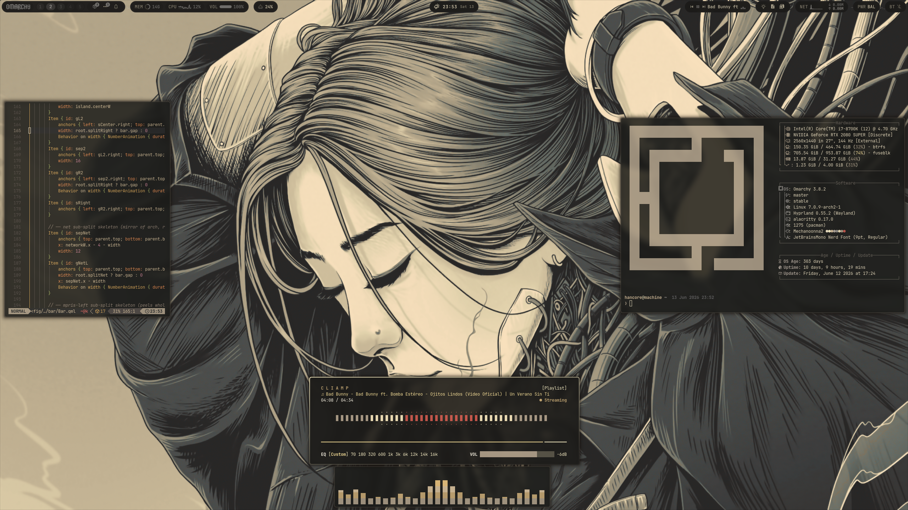

# Mecha no Onna [V2] (メカの女)

A full re-work of Mecha no Onna — see the original [base branch (V1)](https://github.com/HANCORE-linux/omarchy-mechanoonna-theme/tree/mechanoonna-v1).

**What's new in V2:** the palette was rebuilt from the muted-warm originals into a stronger, harmonised set — elevated normal colors plus a coherent bright tier (no more clashing gruvbox brights), on a deeper neutral background. On top of that, a consistent **frosted-glass / blur** layer runs across the whole desktop: terminal, on-screen display (SwayOSD), notifications (Mako), the launcher (Walker) and GTK apps — all tuned to the same warm palette. VS Code gets an exact, auto-generated **Omarchy** color theme, and every app config (foot / kitty / ghostty, Zed, btop, cava, Steam, Zen, Heroic, Vencord, …) is color-synced.

**The goal:** a cohesive cyber-samurai aesthetic where tradition meets circuitry — warm amber tones behind a layer of soft glass.

> **Prefer the original solid look?** Install the [V1 base branch](https://github.com/HANCORE-linux/omarchy-mechanoonna-theme/tree/mechanoonna-v1).

# Installation

**V2 (this branch, default)** — simply use the omarchy-theme-install command:

```bash
omarchy-theme-install https://github.com/HANCORE-linux/omarchy-mechanoonna-theme.git
```

> **VS Code:** after install, open *Preferences: Color Theme* (`Ctrl+K Ctrl+T`) and pick **Omarchy** — the theme is auto-generated by the [Theme-Hook-Manager](#theme-hook-manager) and just needs selecting once.

# Screenshot


# Demo


https://github.com/user-attachments/assets/53d7342e-2952-4b70-889b-9420a8c2c807


# Backgrounds


#### Waybar
[LINK](https://github.com/HANCORE-linux/waybar-themes)

#### Theme-Hook-Manager
[Link](https://github.com/OldJobobo/theme-hook-plugin-manager)

## Acknowledgments
This theme was created using [Aether](https://github.com/bjarneo/aether) by [@bjarneo](https://github.com/bjarneo).

### License
MIT
